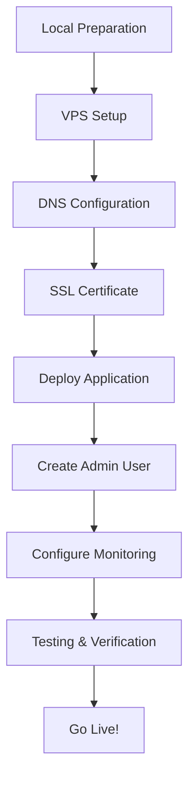

# XOOM Production Deployment - Complete Summary

## 🎉 All Deployment Files Ready for xoomrides.com!

This document summarizes everything that has been prepared for your XOOM production deployment.

---

## 📦 What Has Been Created

### 1. Configuration Files

#### ✅ `backend/.env.production.example`
- Production environment template for backend
- Contains all necessary environment variables
- **Action Required:** Copy to `backend/.env` and fill in secrets

#### ✅ `frontend/.env.production.example`
- Production environment for frontend
- Pre-configured for xoomrides.com
- **Action Required:** Copy to `frontend/.env.production`

#### ✅ `nginx-production.conf`
- Complete Nginx configuration
- SSL/TLS configuration for Let's Encrypt
- WebSocket support for Socket.IO
- Security headers
- Gzip compression
- Static asset caching
- API proxying

#### ✅ `docker-compose.yml` (Updated)
- Production-ready configuration
- Health checks for all services
- Certbot service for SSL renewal
- Proper logging configuration
- Named volumes for data persistence
- Network isolation

### 2. Deployment Scripts

#### ✅ `deploy.sh`
- One-command deployment script
- Automated frontend build
- Docker container orchestration
- Database migration runner
- Health check verification
- Colored output with progress tracking
- Error handling and rollback support

**Usage:** `./deploy.sh`

#### ✅ `backup.sh`
- Automated database backup script
- Compressed backups (gzip)
- 7-day retention policy
- Backup verification
- Size reporting
- Cron-job ready

**Usage:** `./backup.sh`

### 3. Documentation

#### ✅ `DEPLOYMENT_INSTRUCTIONS.md`
- Step-by-step deployment guide
- Environment setup instructions
- Secret generation commands
- Testing procedures
- Troubleshooting section
- Maintenance commands

#### ✅ `VPS_SETUP_GUIDE.md`
- Complete VPS configuration guide
- Docker installation
- Docker Compose setup
- Firewall configuration (UFW)
- Security hardening
- System optimization
- Monitoring tools

#### ✅ `QUICK_START.md`
- 60-minute deployment guide
- Streamlined process
- All commands in sequence
- Testing checklist
- Post-deployment verification

#### ✅ `DEPLOYMENT_SUMMARY.md` (This File)
- Overview of all deliverables
- Quick reference
- Next steps

---

## 🏗️ XOOM Architecture Overview

### Frontend
- **Framework:** React 18 + TypeScript
- **Build Tool:** Vite
- **UI Library:** Shadcn UI + TailwindCSS
- **Maps:** Leaflet.js (OpenStreetMap)
- **Real-time:** Socket.IO Client
- **Routing:** React Router
- **State:** React Context + TanStack Query

### Backend
- **Runtime:** Node.js 18+
- **Framework:** Express.js
- **Database:** PostgreSQL 15
- **Real-time:** Socket.IO Server
- **Authentication:** JWT + Bcrypt
- **Maps:** Multi-provider service (Nominatim/Mapbox/Google)

### Infrastructure
- **Containers:** Docker + Docker Compose
- **Web Server:** Nginx (reverse proxy)
- **SSL:** Let's Encrypt (automatic renewal)
- **Database:** PostgreSQL in Docker
- **File Storage:** Docker volumes

---

## 🎯 All Features Implemented

### Core Functionality

#### Rider Features
- ✅ Interactive map with click-to-place markers
- ✅ Address search with autocomplete
- ✅ Current location detection (GPS)
- ✅ Vehicle type selection (bike/car/auto)
- ✅ Passenger count selector
- ✅ Real-time fare estimation
- ✅ Ride booking
- ✅ Live driver tracking
- ✅ Ride status updates (real-time)
- ✅ Driver rating and review
- ✅ Ride history
- ✅ Profile management

#### Driver Features
- ✅ Online/Offline toggle
- ✅ Automatic location broadcasting (every 10s)
- ✅ Ride request notifications
- ✅ Accept/Decline rides
- ✅ Navigation with pickup/drop markers
- ✅ Ride status updates (arrived/started/completed)
- ✅ Earnings dashboard
- ✅ Rating display
- ✅ Document upload (CNIC, license, vehicle)
- ✅ Profile and statistics

#### Admin Features
- ✅ Real-time dashboard
- ✅ User management (view/block/unblock)
- ✅ Driver verification (approve/reject documents)
- ✅ Fare management (base fare, per km, minimum, surge)
- ✅ Credit system (promotional credits)
- ✅ Announcements (system-wide messages)
- ✅ Ride monitoring (active rides, history)
- ✅ System settings (ride limits)

#### Real-Time Features (Socket.IO)
- ✅ Driver location updates (10s intervals)
- ✅ Ride matching notifications
- ✅ Status change broadcasts
- ✅ WebSocket authentication
- ✅ Auto-reconnection
- ✅ Room-based messaging

### API-First Architecture

#### Map Service Abstraction
- ✅ **Base Provider Interface:** Standardized API contract
- ✅ **Nominatim Provider:** Free OpenStreetMap geocoding
- ✅ **Mapbox Provider:** Premium fallback option
- ✅ **Google Maps Provider:** Enterprise fallback
- ✅ **Automatic Fallback:** Switch on provider failure
- ✅ **Cost Tracking:** API usage monitoring
- ✅ **Health Checks:** Provider availability testing

#### RESTful APIs
- ✅ Authentication endpoints (signup, login, profile)
- ✅ Ride management (create, accept, start, complete, cancel)
- ✅ Driver endpoints (location, documents, earnings)
- ✅ Review system (create, view ratings)
- ✅ Admin endpoints (users, fares, verification)
- ✅ Map endpoints (geocode, reverse, autocomplete, routes)

#### Future-Ready Integration
- ✅ Same APIs for web and mobile apps
- ✅ Third-party integration capability
- ✅ Partner company ride integration
- ✅ Analytics platform data access
- ✅ Payment gateway ready

### Database Schema
- ✅ **17 Tables** fully designed
- ✅ Users (riders, drivers, admins)
- ✅ Rides (full lifecycle tracking)
- ✅ Reviews (mutual rating system)
- ✅ Driver locations (real-time GPS)
- ✅ Driver documents (verification workflow)
- ✅ Fare settings (dynamic pricing)
- ✅ Announcements (targeted messages)
- ✅ Pakistan POI (27+ local places)
- ✅ Subscription payments
- ✅ Ride limits
- ✅ Push notification tokens

---

## 🚀 Deployment Process

### Prerequisites
1. VPS with Ubuntu 20.04/22.04 (4GB RAM, 2 CPU, 40GB storage)
2. Domain: xoomrides.com pointed to VPS IP
3. Node.js 18+ installed locally
4. SSH access to VPS

### Deployment Steps



### Timeline Estimate
- **Local Prep:** 10 minutes
- **VPS Setup:** 15 minutes
- **DNS Config:** 5 minutes (+ 15 min propagation)
- **SSL Certificate:** 10 minutes
- **Deployment:** 20 minutes
- **Admin Setup:** 5 minutes
- **Testing:** 10 minutes

**Total:** ~90 minutes (including DNS propagation wait)

---

## 📝 Quick Commands Reference

### On VPS

```bash
# Navigate to project
cd /var/www/xoom

# Deploy application
./deploy.sh

# View logs
docker-compose logs -f

# Check status
docker-compose ps

# Restart services
docker-compose restart

# Stop services
docker-compose down

# Backup database
./backup.sh

# Update application
git pull origin main
./deploy.sh
```

### On Local Machine

```bash
# Generate database password
node -e "console.log(require('crypto').randomBytes(16).toString('hex'))"

# Generate JWT secret
node -e "console.log(require('crypto').randomBytes(64).toString('hex'))"

# Generate bcrypt hash
node -e "console.log(require('bcrypt').hashSync('YourPassword', 10))"

# Upload to server
rsync -avz --exclude 'node_modules' ./ user@vps:/var/www/xoom/
```

---

## 🔒 Security Checklist

### Implemented Security Features
- ✅ **SSL/TLS:** Let's Encrypt certificates
- ✅ **HTTPS Redirect:** Automatic HTTP to HTTPS
- ✅ **Security Headers:** HSTS, X-Frame-Options, CSP, etc.
- ✅ **Firewall:** UFW configured (ports 22, 80, 443)
- ✅ **Rate Limiting:** API request throttling
- ✅ **CORS:** Properly configured origins
- ✅ **JWT:** Secure token-based auth
- ✅ **Password Hashing:** Bcrypt with salt
- ✅ **Database:** Not exposed to internet
- ✅ **Log Rotation:** Prevent disk space issues

### Additional Recommendations
- [ ] Change SSH default port (optional)
- [ ] Setup Fail2Ban for brute-force protection
- [ ] Configure automatic security updates
- [ ] Setup SSH key-only authentication
- [ ] Configure database connection encryption
- [ ] Setup intrusion detection (optional)

---

## 📊 Monitoring & Maintenance

### Health Check Endpoints
- **Application:** https://xoomrides.com/health
- **Map Providers:** https://xoomrides.com/api/maps/providers/health

### Monitoring Commands
```bash
# Container health
docker-compose ps

# Resource usage
docker stats

# Disk space
df -h

# Memory usage
free -h

# Active connections
netstat -an | grep :443 | wc -l
```

### Automated Tasks
- ✅ **Daily Backups:** Cron job at 2 AM
- ✅ **SSL Renewal:** Automatic via Certbot
- ✅ **Log Rotation:** Prevents disk fill-up

### Manual Maintenance
- **Weekly:** Check logs for errors
- **Weekly:** Verify backups are working
- **Monthly:** Update system packages
- **Monthly:** Review resource usage
- **Quarterly:** Security audit

---

## 🐛 Common Issues & Solutions

### Issue: Cannot connect to database
**Solution:**
```bash
docker-compose ps db
docker-compose logs db
docker-compose restart db
```

### Issue: Frontend not loading
**Solution:**
```bash
cd frontend
npm run build
docker-compose restart nginx
```

### Issue: SSL certificate expired
**Solution:**
```bash
docker-compose run --rm certbot renew
docker-compose restart nginx
```

### Issue: Port already in use
**Solution:**
```bash
sudo lsof -i :80
sudo lsof -i :443
# Kill conflicting process or change port
```

---

## 📈 Scalability Considerations

### Current Capacity
- **Concurrent Users:** ~100-500 (with 4GB RAM)
- **Database Size:** Scales to millions of rides
- **Map API:** Free tier sufficient for initial launch

### Scaling Options
1. **Vertical Scaling:** Upgrade VPS (8GB, 4 CPU)
2. **Horizontal Scaling:** Multiple backend instances
3. **Database Scaling:** Dedicated PostgreSQL server
4. **Load Balancing:** Nginx load balancer
5. **CDN:** Static assets via CDN
6. **Caching:** Redis for sessions and caching
7. **Message Queue:** RabbitMQ/Redis for async tasks

---

## 🎯 Post-Launch Checklist

### Immediate (Day 1)
- [ ] Verify all services running
- [ ] Create test rider account
- [ ] Create test driver account
- [ ] Test complete ride flow
- [ ] Monitor logs for errors
- [ ] Verify SSL certificate working
- [ ] Check real-time updates (Socket.IO)

### Week 1
- [ ] Monitor performance metrics
- [ ] Check database backup success
- [ ] Review error logs
- [ ] Test on different devices/browsers
- [ ] Gather initial user feedback
- [ ] Monitor resource usage
- [ ] Plan marketing launch

### Month 1
- [ ] Analyze user behavior
- [ ] Optimize based on metrics
- [ ] Plan feature additions
- [ ] Review security logs
- [ ] Consider payment integration
- [ ] Expand POI database
- [ ] Setup analytics

---

## 📚 Documentation Index

| Document | Purpose | Audience |
|----------|---------|----------|
| `QUICK_START.md` | 60-min deployment guide | DevOps/Developer |
| `DEPLOYMENT_INSTRUCTIONS.md` | Detailed deployment steps | DevOps/Developer |
| `VPS_SETUP_GUIDE.md` | Server configuration | System Admin |
| `DEPLOYMENT_SUMMARY.md` | Overview & reference | All |
| `docs/API.md` | API documentation | Developers |
| `docs/FEATURES.md` | Feature list | Product Team |
| `docs/SETUP.md` | Local development setup | Developers |
| `CHANGELOG.md` | Change history | All |

---

## 🚦 Next Steps

### 1. **Review Documentation** (30 minutes)
   - Read `QUICK_START.md` for deployment overview
   - Review `DEPLOYMENT_INSTRUCTIONS.md` for details
   - Check `VPS_SETUP_GUIDE.md` for server setup

### 2. **Prepare Secrets** (5 minutes)
   - Generate strong database password
   - Generate JWT secret (64+ characters)
   - Save securely (password manager)

### 3. **Setup VPS** (20 minutes)
   - Follow `VPS_SETUP_GUIDE.md`
   - Install Docker and Docker Compose
   - Configure firewall
   - Upload project files

### 4. **Configure DNS** (5 minutes + waiting)
   - Point xoomrides.com to VPS IP
   - Point www.xoomrides.com to VPS IP
   - Wait for propagation (5-15 minutes)

### 5. **Deploy** (30 minutes)
   - Get SSL certificate
   - Run `./deploy.sh`
   - Monitor deployment
   - Verify services

### 6. **Test** (20 minutes)
   - Create admin user
   - Sign up as rider
   - Sign up as driver
   - Test ride booking
   - Verify real-time updates

### 7. **Go Live!** 🎉
   - Monitor for 24 hours
   - Start onboarding users
   - Begin marketing

---

## 💡 Tips for Success

1. **Don't Skip Steps:** Follow the guides in order
2. **Save Secrets:** Store passwords in password manager
3. **Test Locally First:** Build frontend locally before deploying
4. **Monitor Logs:** Watch logs during deployment
5. **Backup Before Changes:** Run backup.sh before updates
6. **Document Custom Changes:** Note any modifications
7. **Plan Downtime:** Schedule updates during low-traffic times

---

## 🆘 Getting Help

### If Something Goes Wrong

1. **Check Logs**
   ```bash
   docker-compose logs -f
   ```

2. **Check Health**
   ```bash
   docker-compose ps
   curl https://xoomrides.com/health
   ```

3. **Review Documentation**
   - Troubleshooting sections in guides
   - Error messages in logs

4. **Rollback if Needed**
   ```bash
   docker-compose down
   # Restore from backup
   # Fix issue
   ./deploy.sh
   ```

---

## ✅ Summary

### What You Have
- ✅ Complete production-ready codebase
- ✅ All configuration files
- ✅ Deployment scripts
- ✅ Comprehensive documentation
- ✅ Security best practices
- ✅ Monitoring setup
- ✅ Backup system

### What You Need to Do
1. Setup VPS
2. Configure DNS
3. Get SSL certificate
4. Run deployment script
5. Create admin user
6. Test thoroughly
7. Launch!

---

## 🎊 Congratulations!

You now have everything needed to deploy XOOM to production on **xoomrides.com**.

The platform is:
- **Secure:** SSL, firewall, rate limiting, auth
- **Scalable:** API-first, containerized, stateless
- **Maintainable:** Documented, automated, monitored
- **Feature-Rich:** Rides, reviews, real-time, admin
- **Future-Proof:** API-first for mobile apps and integrations

**Ready to launch your ride-hailing business!** 🚀

---

*Last Updated: December 31, 2025*
*Project: XOOM Ride-Hailing Platform*
*Domain: xoomrides.com*

